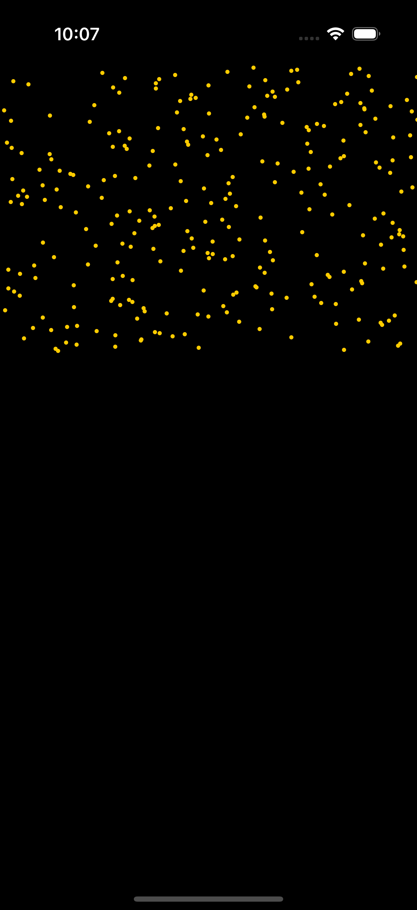

# Falling Sand Animation

A sample Project simulating the falling particles animation.

## Table of Contents

- [Preview](#preview)
- [Getting Started](#getting-started)
  - [Prerequisites](#prerequisites)
  - [Check it out yourself](#check-it-out-yourself)
- [Usage](#usage)

## Preview



## Getting Started

Setting up your project and run locally.

### Prerequisites

- `XCode`
- `Swift`
- `SwiftUI`

### Check it out yourself

Step-by-step guide on how to install and set up the project.

1. Clone the repository:
   ```bash
   git clone https://github.com/Aakarsh-verma/FallingSand.git
   ```
2. Navigate to the project directory open `FallingSand.xccodeproj` and run the project
